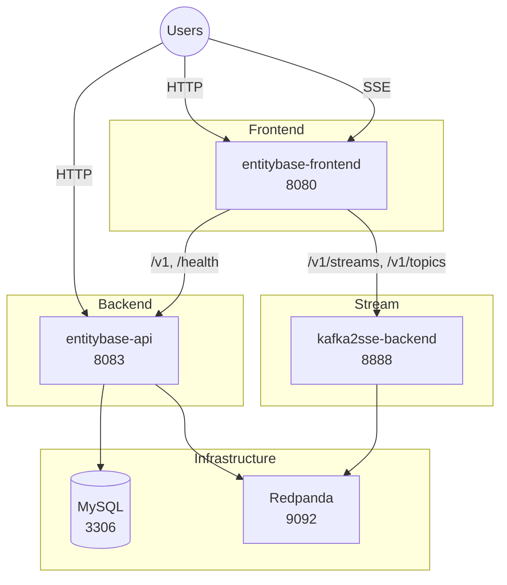

# Entitybase

Monorepo for Entitybase services: the REST API backend, a Vue frontend
(entities + live change stream), and the SSE change-stream backend.

## Architecture



Everything the API persists lives in MySQL (entities, revisions,
statements, metadata). Change events flow through Redpanda: the API
publishes `entity_change` events, and the stream backend fans them out
as Server-Sent Events to the frontend's **Change stream** tab.

## Repository Layout

| Directory | Description |
|-----------|-------------|
| `entitybase-backend/` | REST API (FastAPI, MySQL) |
| `entitybase-frontend/` | Vue SPA: entities + change stream tabs |
| `kafka2sse-backend/` | SSE change-stream backend (Kafka → SSE) |
| `e2e-ui/` | Playwright e2e tests |
| `*_worker/` | Background workers, one project each (JSON/TTL dumps, entity diff, watchlist, stats, Meilisearch indexer). They talk to the database directly and are disabled by default |
| `scripts/` | Build, health check and dev mock helpers |

## Quick Start

```bash
# Build Docker images and start the whole stack
just up

# Check the health of all services
just health

# Service URLs
just docker-help
```

`just up` creates `.env` from `env.example` on first run, builds the
images, starts the stack and waits for the API to become healthy.

## Development

The frontend runs as a vite dev server outside docker during
development:

```bash
cd entitybase-frontend
npm install
npm run dev        # http://localhost:8085 (proxies to the docker API)
```

Backend and frontend unit tests, plus mock-based e2e tests without
docker:

```bash
cd entitybase-backend && just lint-test-all   # via the backend justfile
cd entitybase-frontend && npm test
just e2e-mock        # Playwright e2e against mock backends (no docker)
just e2e             # Playwright e2e against the running docker stack
```

## Just Commands

| Command | Description |
|---------|-------------|
| `just up` | Build images and start the whole stack |
| `just down` | Stop the stack |
| `just down-v` | Stop the stack and remove volumes (fresh database) |
| `just logs` | Follow logs from all services |
| `just health` | Health table for all services (exit 1 on failure) |
| `just docker-help` | Print the service URLs |
| `just e2e` | Playwright e2e against the running stack |
| `just e2e-mock` | Playwright e2e against mock backends (no docker) |
| `just frontend` | Run the frontend dev server |
| `just test-workers` | Run the unit tests of every worker project |

## Services (docker compose)

| Service | Port | Description |
|---------|------|-------------|
| entitybase-frontend | 8080 | UI: entities + change stream (nginx) |
| entitybase-api | 8083 | REST API |
| kafka2sse-backend | 8888 | Change events as SSE |
| mysql | 3306 | Database (entities, revisions, statements, metadata) |
| redpanda | 9092 | Kafka broker (change events) |
| valkey | 6379 (internal) | Cache used by the stream backend |

The API creates its Kafka topics (`entity_change`) automatically at
startup, so a fresh cluster works out of the box.

## Continuous Integration

GitHub Actions run lint + unit/contract/integration tests per backend,
frontend unit tests, the unit tests of each worker project, and the
Playwright e2e suite against the real docker stack.
See [.github/workflows/ci.yml](.github/workflows/ci.yml).

## License

This project is licensed under the [GNU General Public License v3.0 or later](LICENSE).
