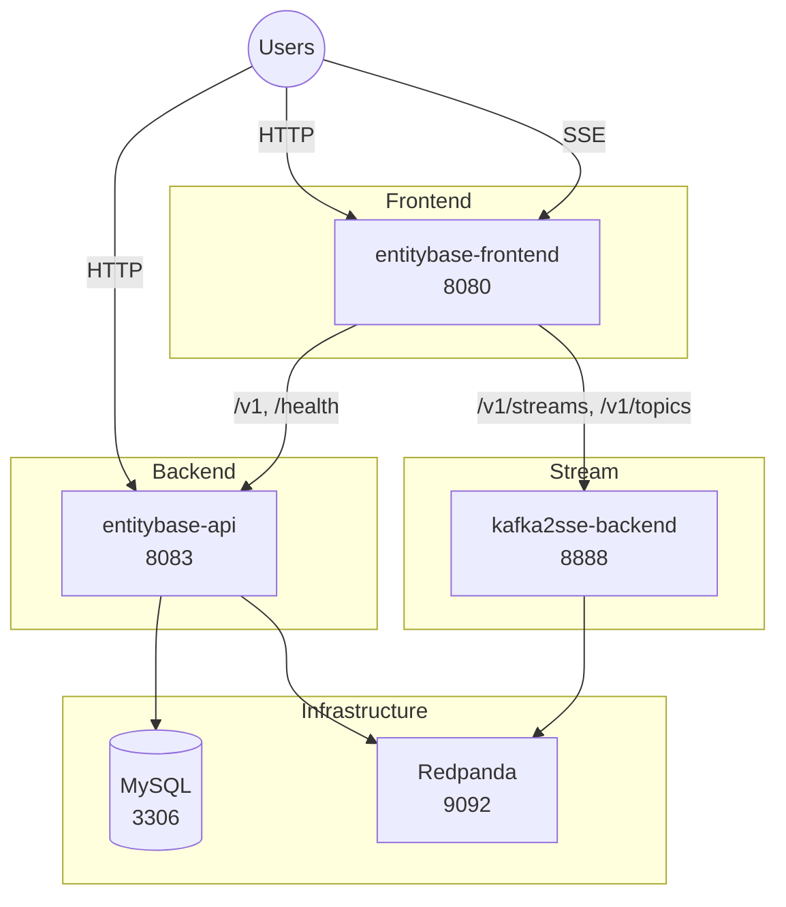

# Entitybase

Monorepo for Entitybase services: a REST API backend (FastAPI + MySQL),
a Vue frontend (entities + live change stream), and an SSE change-stream
backend (Kafka → SSE).

## Architecture

Everything the API persists lives in MySQL: entities, revisions,
statements, qualifiers, references, snaks and metadata. There is no
object storage in the stack anymore.

Change events flow through Redpanda: the API publishes `entity_change`
events, and the stream backend fans them out as Server-Sent Events to
the frontend's **Change stream** tab.

## Repository Layout

| Directory | Description |
|-----------|-------------|
| `entitybase-backend/` | REST API (FastAPI, MySQL) |
| `entitybase-frontend/` | Vue SPA: entities + change stream tabs |
| `kafka2sse-backend/` | SSE change-stream backend (Kafka → SSE) |
| `e2e-ui/` | Playwright e2e tests |
| `scripts/` | Build, health check and dev mock helpers |

## Services (docker compose)

| Service | Port | Description |
|---------|------|-------------|
| entitybase-frontend | 8080 | UI: entities + change stream (nginx) |
| entitybase-api | 8083 | REST API |
| kafka2sse-backend | 8888 | Change events as SSE |
| mysql | 3306 | Database |
| redpanda | 9092 | Kafka broker (change events) |
| valkey | 6379 (internal) | Cache used by the stream backend |

The API creates its Kafka topics (`entity_change`) automatically at
startup, so a fresh cluster works out of the box.
