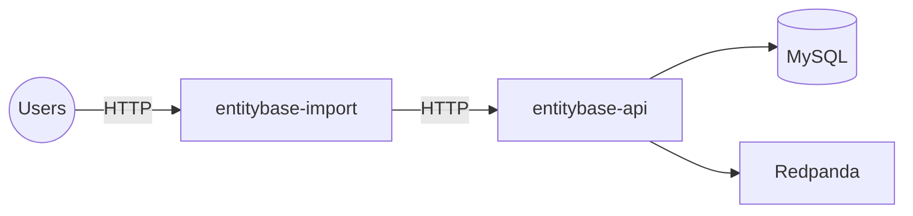

# Entitybase Import

> **Status:** planned component. The diagram below shows where it fits in
> the architecture; implementation details will be documented here as the
> service takes shape.

Entitybase Import is a dedicated service for getting data **into**
Entitybase in bulk. It sits between users and the backend API and is the
recommended entry point for anything beyond single interactive edits:
initial imports, periodic syncs from external sources (Wikidata dumps,
authority files, CSVs), and large batch migrations.

## Position in the architecture

## IDs: no range allocation needed for imports

Imported entities **keep their original Wikidata IDs** (Q42, P31, L123).
Range-based ID generation exists only for interactive auto-assigned IDs:
the `EnumerationService` floor (Q300M+) is chosen so auto-assigned IDs
never collide with imported ones.

The API already supports this without any ID generation:

- **`POST /v1/import`** — unified import endpoint for items, properties
  and lexemes. The `id` field is **required**; enumeration is skipped
  entirely and a conflicting ID returns 409.
- All create handlers (`item`, `property`, `lexeme`) skip the
  `EnumerationService` whenever an explicit `id` is provided
  (`auto_assign_id=not bool(request.id)`).
- A **JSONL dump importer** (`EntityJsonImportHandler`) exists in the
  backend: it reads Wikidata JSONL dump files and supports
  `start_line`/`end_line` + `worker_id` partitioning, designed for
  importing a large dump in parallel chunks with per-line error logs.
  It is currently an in-process handler, not yet exposed over HTTP.

## Design principles

- **API-only writes.** The import service never touches MySQL or
  Redpanda directly. Every entity it creates or updates goes through the
  public REST API, so imports get exactly the same validation,
  schema enforcement, deduplication, immutable revisions and change
  events as interactive edits.
- **Resumable batches.** Imports are split into batches with progress
  tracking, so a large import can be retried or resumed without
  duplicating data.
- **Backpressure aware.** The service throttles request rates against
  the API instead of overwhelming it, and reports per-batch errors
  without aborting the whole import.

## Data flow

1. The user provides a source (dump file, CSV, external API) to
   `entitybase-import`.
2. The service transforms the source into Entitybase API payloads
   (items, properties, lexemes, statements).
3. Batches are sent to the API (`POST /v1/entities/...`), with
   `X-User-ID` and `X-Edit-Summary` headers attributing the import.
4. Each successful write publishes an `entity_change` event to
   Redpanda, so the change stream UI shows imported entities in real
   time.
5. The service reports progress, conflicts (409), and validation
   failures (400/422) per item.

## See also

- [Architecture](ARCHITECTURE.md)
- [Change Streaming](CHANGE-STREAMING/CHANGE-NOTIFICATION.md)
- [Endpoints](../ENDPOINTS.md)
