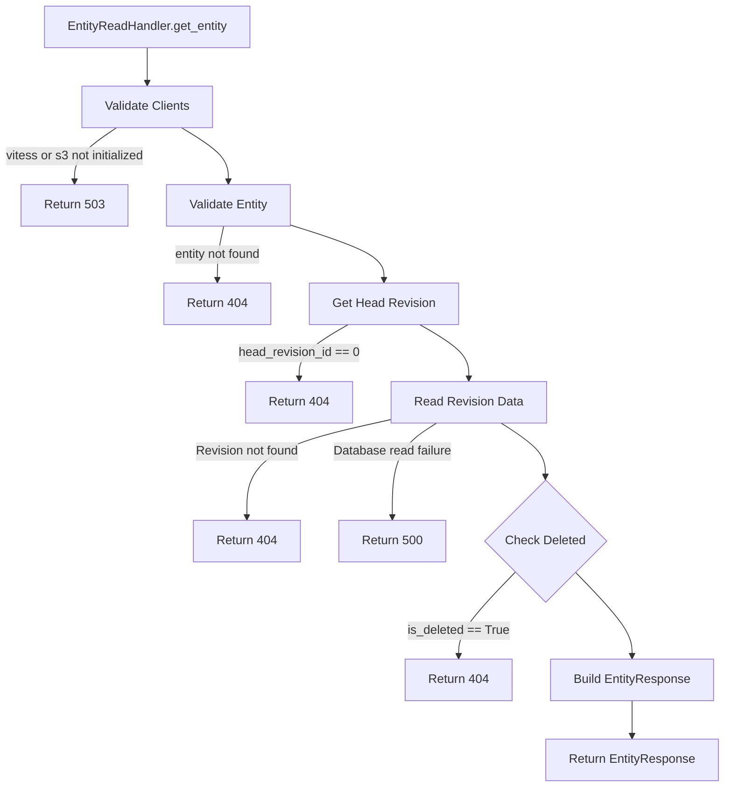

# Entity Get Process

> **⚠️ Status note (2026-09):** S3/MinIO storage has been removed from the stack. Everything — entities, revisions, statements, qualifiers, references, snaks and metadata — is stored in MySQL. This document is kept for historical context; sections describing S3/MinIO no longer apply.

## Error Handling
- Vitess not initialized → 503 Service Unavailable
- Entity not found in Vitess → 404 Not Found
- Head revision 0 → 404 Not Found
- Entity marked as deleted → 404 Not Found
- Revision not found → 404 Not Found
- Database read failure → 500 Internal Server Error
